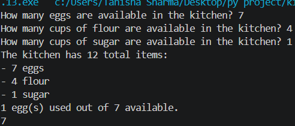
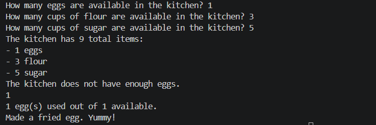

# 🥚 Kitchen Stock Manager

A simple Python project that demonstrates **variables, user input, functions, conditions, arithmetic operations, and return values**.

The program allows the user to enter the available quantity of eggs, flour, and sugar, checks the total kitchen stock, and provides functions to use eggs and make a fried egg.

## 📌 Features

* Takes kitchen stock as input from the user.
* Stores the quantity of:

  * 🥚 Eggs
  * 🌾 Flour
  * 🍚 Sugar
* Calculates the total number of available items.
* Displays the kitchen stock.
* Checks whether enough eggs are available.
* Uses eggs from the available stock.
* Simulates making a fried egg.
* Prevents using more eggs than are available.

## 🛠️ Technologies Used

* **Python 3**
* `input()`
* Variables
* Functions
* `if-else` conditions
* Arithmetic operators
* f-strings
* Return values

## 📂 Project Structure

```text
kitchen-stock-manager/
│
├── kitchen_stock.py
└── README.md
```

## ▶️ How to Run

### 1. Install Python

Make sure Python 3 is installed on your computer.

Check your Python version:

```bash
python --version
```

### 2. Run the Program

Open the project folder in a terminal and run:

```bash
python kitchen_stock.py
```

## 💻 How the Program Works

### 1. Enter Kitchen Stock

The program asks the user for the available eggs, flour, and sugar.

```python
available_eggs = int(input('How many eggs are available in the kitchen? '))
available_flour = int(input('How many cups of flour are available in the kitchen? '))
available_sugar = int(input('How many cups of sugar are available in the kitchen? '))
```

### 2. Check Kitchen Stock

The `check_kitchen_stock()` function calculates the total number of items and displays the available ingredients.

```python
def check_kitchen_stock():
    total_items = available_eggs + available_flour + available_sugar
    print(f'The kitchen has {total_items} total items:')
    print(f'- {available_eggs} eggs')
    print(f'- {available_flour} flour')
    print(f'- {available_sugar} sugar')
```

### 3. Use Eggs

The `use_eggs()` function checks whether the kitchen has enough eggs.

```python
def use_eggs(available_eggs, eggs_to_use):
    if eggs_to_use > available_eggs:
        print('The kitchen does not have enough eggs.')
        return available_eggs

    print(f'{eggs_to_use} egg(s) used out of {available_eggs} available.')
    return available_eggs - eggs_to_use
```

If enough eggs are available, the function subtracts the eggs being used.

### 4. Make a Fried Egg

The `make_fried_egg()` function checks whether at least one egg is available.

```python
def make_fried_egg(available_eggs):
    has_enough_eggs = available_eggs >= 1

    if has_enough_eggs:
        available_eggs = use_eggs(available_eggs, 1)
        print('Made a fried egg. Yummy!')
    else:
        print('Could not make a fried egg. Not enough eggs!')

    return available_eggs
```

## 🧪 Example

### Input

```text
How many eggs are available in the kitchen? 6
How many cups of flour are available in the kitchen? 3
How many cups of sugar are available in the kitchen? 2
```

### Output

```text
The kitchen has 11 total items:
- 6 eggs
- 3 flour
- 2 sugar

4 egg(s) used out of 6 available.
6

1 egg(s) used out of 6 available.
Made a fried egg. Yummy!
```

## 📚 Concepts Practiced

This project is useful for practicing:

1. **Variables**
2. **User Input**
3. **Integer Conversion**
4. **Functions**
5. **Function Parameters**
6. **Conditional Statements**
7. **Boolean Expressions**
8. **Arithmetic Operations**
9. **f-Strings**
10. **Return Statements**
11. **Basic Resource/Stock Management**

## ⚠️ Important Note

In the current program:

```python
use_eggs(available_eggs, 4)
print(available_eggs)
```

the returned value from `use_eggs()` is not assigned back to `available_eggs`.

Therefore, the original variable does not change.

To actually update the available eggs, you can write:

```python
available_eggs = use_eggs(available_eggs, 4)
print(available_eggs)
```

Similarly, when making a fried egg:

```python
available_eggs = make_fried_egg(available_eggs)
```

This keeps the updated egg quantity.

output:




## 👩‍💻 Author

**Tanisha**

This project was created as a Python practice project to improve programming fundamentals and problem-solving skills.
